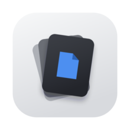

<div align="center">



# DClutter

**Swipe to clean your files.**

One file at a time, with a real preview and the metadata that actually decides
its fate. Keep it, trash it, or file it — with a gesture or a keystroke.

[](https://github.com/RokiTheWise/DClutter/actions/workflows/ci.yml)
[](https://www.apple.com/macos/)
[](https://swift.org)
[](https://github.com/RokiTheWise/DClutter/stargazers)
[](LICENSE)

[](https://github.com/RokiTheWise/DClutter/releases)
[](https://github.com/RokiTheWise/DClutter/releases)

</div>

---

## What this is

A Downloads folder tends to fill up with files we're undecided about. Measuring
a real 771-item one, every duplicate in it combined wasted 27 MB — half a
percent. That led somewhere I didn't expect: space wasn't the problem, the 771
unmade decisions were.

So DClutter is a **decluttering tool, not a disk-space tool**. It shows you one
file at a time and asks for a single decision. Progress is measured in files
resolved, never in bytes reclaimed.

It reads `~/Downloads` and nothing else.

## How it works

Files are ranked rather than listed alphabetically. The score is additive — size,
staleness, whether it was ever opened, whether it's a redundant copy, whether
it's an archive you already extracted — so no single signal can drown out the
others. Duplicates are found by filename and size, no hashing.

Whether that ordering actually surfaces the right things first is the open
question, and the main thing worth telling me about.

Then you decide:

- **Keep** — does nothing. The file stays exactly where it is.
- **Trash** — staged, not deleted. Nothing is touched until you review the list
  and confirm. Files go to the Trash, never `unlink`.
- **File it** — moves immediately into one of three folders you choose, and is
  undoable.

Reversibility is matched to risk: keep is free, a move is instant but undoable,
and a deletion requires an explicit confirmation of a list you can see.

## Controls

Keyboard is the primary interface; every action has a pointer equivalent.

### Keyboard

| Key | Action |
|---|---|
| `→` | Keep, next card |
| `←` | Stage for trash, next card |
| `Space` | Skip — comes back at the end |
| `1` – `3` | File into a destination folder |
| `↑` | Open the destination shelf |
| `←` `→` then `⏎` | Choose a folder and file it |
| `⌫` | Remove the highlighted folder |
| `Esc` / `↓` | Close the shelf |
| `⏎` | Open this file |
| `↓` | Rename this file |
| `⌘Z` / `⇧⌘Z` | Undo / redo |
| `⌘⏎` | Review and trash staged files |
| `⌘N` | Add a destination folder |
| `?` | Show the controls |

### Trackpad and mouse

| Gesture | Action |
|---|---|
| Swipe right / left | Keep / stage for trash |
| Two fingers up | Open the shelf, slide across, let go to file |
| Drag back down | Close the shelf without filing |
| Double-click | Open the file |
| Right-click | Reveal in Finder, rename, copy name |

## Install

**[⬇ Download DClutter 0.4.0](https://github.com/RokiTheWise/DClutter/releases/download/v0.4.0/DClutter-0.4.0.zip)**
&nbsp;·&nbsp; [all releases](https://github.com/RokiTheWise/DClutter/releases)

Then, because this build isn't signed by Apple yet, macOS needs you to approve it
once:

1. Unzip it and drag **DClutter.app** into your **Applications** folder.
2. Double-click it. **macOS will refuse to open it — this is expected.**
3. Open **System Settings → Privacy & Security**, scroll to the bottom, and click
   **Open Anyway** next to DClutter.
4. Click **Open** to confirm.

That's it. It opens normally from then on.

<details>
<summary>Why does macOS block it?</summary>

The warning says macOS "could not verify" the app. That's accurate, and it isn't
a claim that something is wrong with it: verifying an app requires an Apple
Developer certificate, which costs $99/year and this project doesn't have one
yet. Every unsigned app shows the same message.

What you can do instead of taking that on trust: the entire source is in this
repository, and you can build it yourself in a couple of minutes (below), which
skips the warning entirely because locally-built apps are never quarantined.

</details>

<details>
<summary>Build it yourself instead</summary>

An app you compile locally is never quarantined, so it just opens — no warning,
no approval step. Requires Xcode 16+.

```bash
git clone https://github.com/RokiTheWise/DClutter.git
cd DClutter && open DClutter.xcodeproj
```

Then press ⌘R.

</details>

<details>
<summary>Copied from a USB stick or your local network?</summary>

Files that never touch the internet aren't quarantined, so the app opens with no
prompt at all. Nothing extra to do.

</details>

## Building

Requires Xcode 16+ and macOS 14+.

```bash
open DClutter.xcodeproj
```

The core logic is a standalone SwiftPM package and its tests run without Xcode:

```bash
swift test --package-path DClutterKit
```

## Architecture

Three modules, with a hard boundary between metadata acquisition and everything
else — so a future port reimplements one protocol rather than the whole app, and
so the logic is testable without a UI.

| Module | Contains | Depends on |
|---|---|---|
| `DClutterCore` | Scoring, the session state machine, file metadata | Foundation only |
| `DClutterPlatform` | Trash, move, rename, destination bookmarks | Core |
| `DClutterUI` | SwiftUI views | Core + Platform |

`DClutterCore` never touches AppKit and never performs a destructive file
operation. It records what should happen and reports back the disk work its
caller must carry out.

### Safety rules

These hold on every commit and are covered by tests:

1. No code path calls `removeItem` on a user file — only `trashItem`.
2. Nothing outside `~/Downloads` or a folder you explicitly chose is touched.
3. Staged files are untouched on disk until you confirm.
4. A move registers its undo before the file is touched, never after.
5. Session state is written after every decision, so quitting loses nothing.

## Status

Pre-release, in active development. Keep, trash, file, rename, undo/redo and
gestures all work; the app is used daily by its author.

Not done yet: notarized distribution, and renaming a destination bin's label.

## License

Apache-2.0. See [LICENSE](LICENSE).
